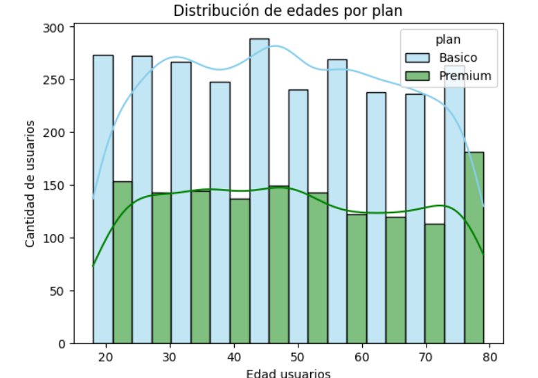
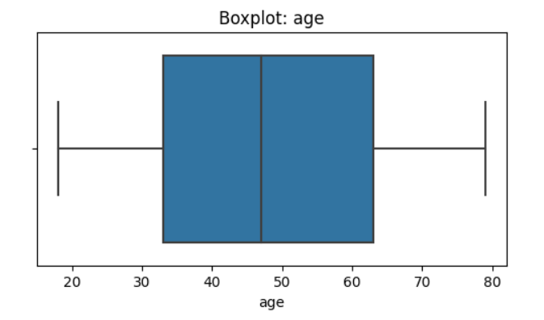
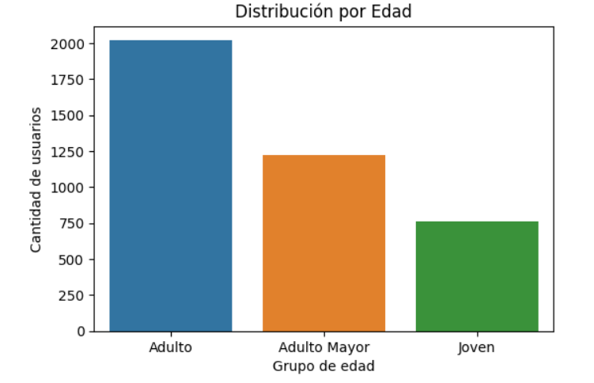
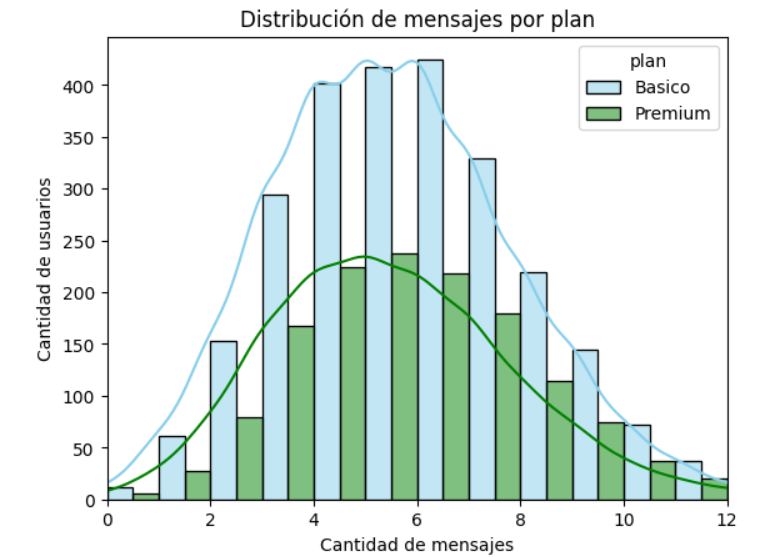
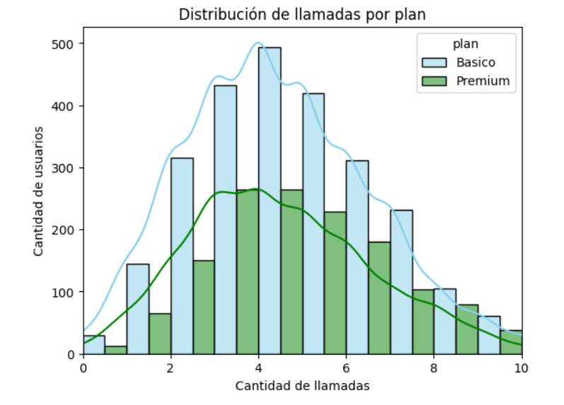
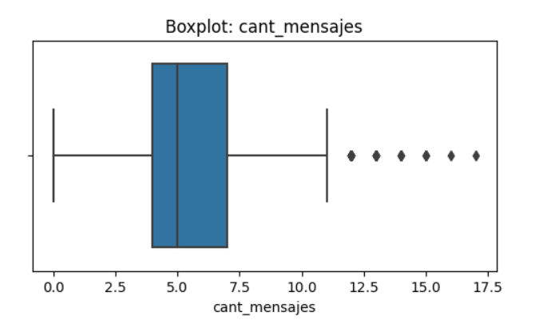
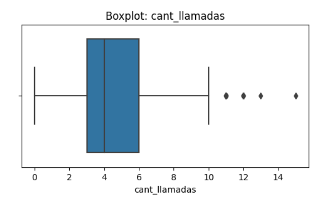
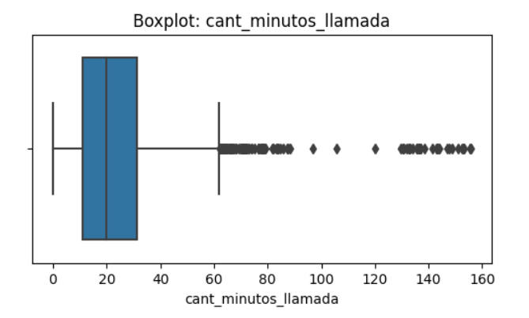
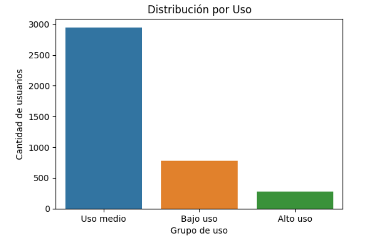

# telecom-analysis
ConnectaTel, una empresa de telecomunicaciones con operaciones en México y Colombia tiene como objetivo identificar patrones de uso, detectar comportamientos atípicos y comprender qué segmentos de clientes muestran necesidades diferenciadas, con el fin de optimizar la oferta comercial y mejorar la experiencia del usuario.

**💡Preguntas del negocio**

-¿Qué segmentos de clientes muestran mayor o menor uso de llamadas y mensajes?

-¿Qué usuarios presentan valores atípicos que puedan indicar comportamientos inusuales, fraude o errores de registro?

-¿Cómo varía el uso según la edad y el tipo de plan contratado?

-¿Qué patrones pueden ayudar a diseñar mejores planes, optimizar la oferta y mejorar la satisfacción del cliente?

⚠️ **Problemas detectados en los datos** 

En la columna `age`con un conteo de 4000 registros se identificó que la edad promedio era de 33 años; sin embargo, se pudieron detectar valores inválidos ya que el mínimo registrado era un número negativo afectando los datos estadísticos e incluso, se visualizó una desviación estándar de 123 (dato imposible hablando de edades) y una mediana de 47 (dicho sesgo a consecuencia de los sentinels en la columna). Como método de limpieza se reemplazó el sentinel -999 con la mediana.

En el DataFrame existían registros del año 2022 al 2026 (columna `reg_date`) Es decir, había anomalías debido a que el último año posible era el 2024. 
Los datos de interés para nuestro análisis (2024) dieron una suma de 1330 registros, que representando el 33.25% de todo el DataFrame y solo el 0.12% del total de los datos fueron nulos. Como alternativa simplemente Se ignoraron los 50 registros debido a su baja proporción.

Se identificaron valores faltantes en las columnas `duration`(55.19%) y `length`(44.74%); sin embargo después de un análisis adicional se determinó que ambas columnas dependen totalmente de type. La duración hace referencia a las llamadas y la longitud hace referencia a los mensajes de texto.

📌Se encontraron valores faltantes en otras columnas tales como: City (11.72%), Churn_date (88.35%) y Date (0.12%). Se manejaron los datos en etapa de limpieza sin embargo no representan importancia para nuestro análisis y evaluación de preguntas del negocio.

## 🔍 **Segmentos por Edad** ##

El comportamiento de mercado en ConnectaTel es bastante contundente y se encuentra bien definido. Su `mercado objetivo` son las personas que oscilan entre los `30 y 59 años de edad` representando el `50.45%`. Se debe analizar a fondo si las estrategias de mercado actuales son las que están captando este mercado en específico o simplemente es un comportamiento orgánico; una vez que se tenga identificado lo anterior, se recomienda lo siguiente:

- Si es consecuencia de una estrategia de mercado actual, valdría la pena no solo reforzarla para la captación de un mayor número de usuarios de este rango de edad sino también el desarrollo de estrategias adicionales que vayan dirigidas a los segmentos restantes con el fin de impulsar su consumo e incluso, para lograr entender sus necesidades particulares y expectativas de servicio (que indudablemente no están siendo atendidas en su totalidad) para poder ocupar mayor espacio dentro del ámbito de telecomunicaciones.

- En su defecto, si se trata de un comportamiento orgánico se debe impulsar una campaña comercial para aprovechar la presencia en este segmento de mercado y captar mayor utilidad para la empresa.

Contamos con información adicional como lo es que los tres segmentos prefieren el plan Básico y el servicio de mensajería. Nuevamente, se requiere indagar a mayor profundidad dichas preferencias ya que, como la práctica y la lógica han demostrado a lo largo del tiempo, todos los mercados se llegan a diferenciar en hábitos de compra y uso de servicios. Podría llegar a intuirse de primera instancia que los beneficios y/o facilidades del plan Básico y mensajería son más promocionados o generan un valor comercial para todos y cada uno de los usuarios de ConnectaTel. Se recomienda hacer un estudio de las ofertas comerciales de la empresa y apartir de ello, tomar decisiones sobre sus productos, precios, campañas de marketing, etc.

  

  

  

📊 **Segmentos por Nivel de Uso**

En todos y cada uno de los niveles de uso, la edad predominante son los Adultos. Sin embargo, un aspecto importante a recalcar es que el `55.20%` de los `heavy users` pertenecen a dicho segmento. Nuevamente se comprueba que los outliers detectados en etapa tempranas del análisis se trataban de registros reales y esenciales. 

💡Se hace hincapié en las recomendaciones en el punto anterior; recordemos que un correcto entendimiento de mercado permitirá mayor claridad, eficiencia y eficacia en la designación de recursos que, a su vez, representen ganancias y valor a la empresa.

  

  

  

  

  

  

